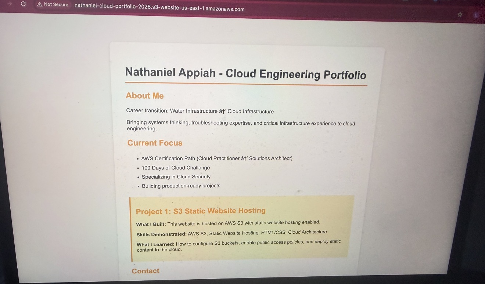
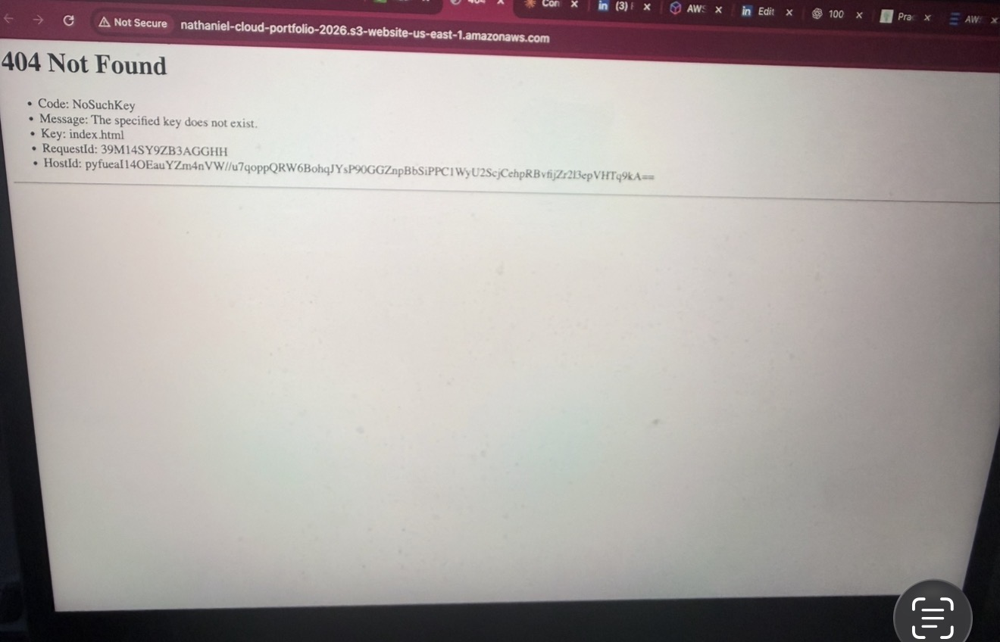

# AWS S3 Static Website Hosting

This project demonstrates how to host a simple static website using Amazon S3.

It is my first hands on AWS project, focused on understanding how cloud services actually work in practice rather than just learning theory.

---

## Architecture

A user accesses a static website through a web browser.  
The browser sends an HTTP request directly to an Amazon S3 bucket configured for static website hosting.  
Amazon S3 serves the static HTML file (`index.html`) to the user.

**Flow:**
User Browser → HTTP → AWS S3 Bucket → index.html

---

## What I Built

- An Amazon S3 bucket configured for static website hosting
- Public access enabled using bucket policies
- A simple HTML page deployed as `index.html`
- A live website accessible via the S3 website endpoint

---

## Why Businesses Use S3 for Static Websites

- No servers to manage
- Very low cost
- High availability and durability
- Scales automatically
- Ideal for portfolios, landing pages, documentation, and marketing sites

---

## Skills Demonstrated

- AWS S3
- Static website hosting
- Bucket policies and public access configuration
- Basic HTML
- Cloud architecture fundamentals

---

## Lessons Learned

- Static websites require proper file formats (HTML, not RTF)
- Public access must be explicitly configured for S3
- Cloud services behave differently than local environments
- Real learning happens when mistakes are made and fixed

---

## Limitations

- Website uses HTTP only (no HTTPS)
- No custom domain
- No CDN or caching layer

---

## Next Improvements

- Add CloudFront for HTTPS and caching
- Add a custom domain using Route 53
- Restrict S3 access using Origin Access Control
- Apply security best practices

---

## Background

Career transition from water infrastructure to cloud engineering.  
Building hands-on projects to develop real cloud skills.

## Screenshots

### Static website hosted on Amazon S3

### 404 error encountered during setup

